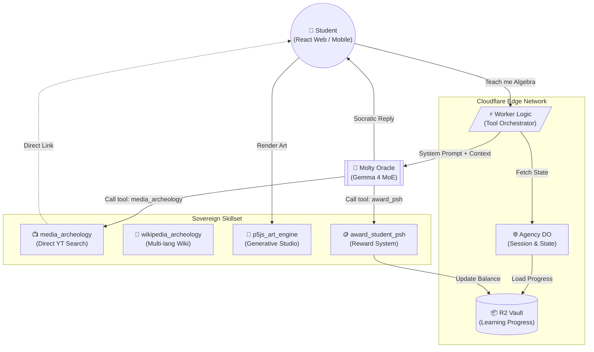

# 🎓 Molty Pedagogical Agency: Google Gemma 4 Hackathon

> *Reimagining the learning journey through an adaptive, multi-tool agent powered by Google Gemma 4. A sovereign pedagogical swarm designed for global impact.*

## 🌟 The Vision: Sovereign Education
Molty Agency is more than a chatbot; it's a **Pedagogical Sovereign Node**. By integrating Google Gemma 4 (MoE) with a multi-tool skillset, we've created an agent that doesn't just answer—it **teaches**. Using the Socratic Method, Molty guides students through personalized 3-step learning paths, rewarding real progress with on-chain incentives.

## ⚙️ Modern Technology Stack
- **Core LLM:** `Google Gemma 4 (26B-A4B Mixture-of-Experts)` native on Cloudflare Edge AI.
- **Memory Layer:** Cloudflare **Durable Objects** for stateful conversation history and **R2** for persistent learning progress.
- **Frontend Engine:** React 19 + Framer Motion (Glassmorphism UI).
- **Art Engine:** Interactive **p5.js** generative studio with live code viewer.
- **Global Reach:** Native tri-lingual support (English, Spanish, Portuguese) with localized curriculum (Common Core / BNCC).

---

## 🗺️ Architectural Map



---

## 🚀 Key Features

### 1. The Socratic Loop (Teach-Challenge-Reward)
Molty never gives direct answers. It follows a strict pedagogical cycle:
1. **Define Plan:** Outlines a 3-step cognitive journey.
2. **Explain:** Socratic explanation tailored to the student's level.
3. **Challenge:** A PBL (Project Based Learning) task to verify understanding.
4. **Reward:** Instant award of **Pooptoshis (Psh)** upon success.

### 2. Generative Art Monitor
A live creative coding environment where Molty's explanations come to life through **p5.js**.
- **Interactive Controls:** Adjust speed, density, and chaos in real-time.
- **Code Viewer:** Students can read the exact p5.js source code to learn by seeing.

### 3. Anti-Hallucination Tools
We've implemented defensive tool-calling:
- **Media Archeology:** Instead of inventing links, Molty provides direct, educational YouTube search results.
- **Wikipedia Archeology:** Direct access to academic summaries across three languages.

---

## 🛠️ Installation & Deployment

### 1. Requirements
- Node.js 18+
- Cloudflare Account (with AI access)
- Google Gemini API Key (for secondary synthesis)

### 2. Launch the Agent Backend
```bash
# Clone the repository
git clone https://github.com/urielhernandez/moltys-gemma
cd moltys-gemma

# Deploy to Cloudflare Workers
npx wrangler deploy
```

### 3. Launch the Pedagogical Dashboard
```bash
cd agency-frontend
npm install
npm run dev # Local development
npm run build && npx wrangler pages deploy dist --project-name moltys-agency
```

*Built with ❤️ for the Google Developer Hackathon.*
