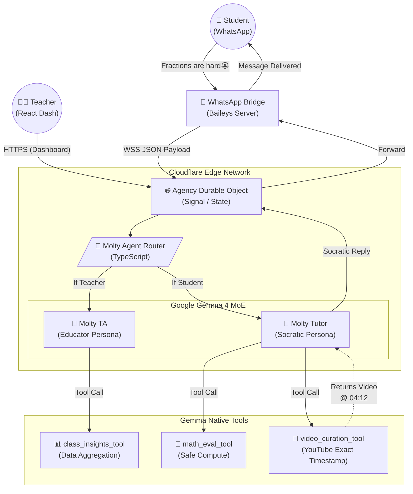

# 🎓 Edu-Molty: Google Gemma 4 Hackathon

> *Reimagining the learning journey through an adaptive, multi-tool agent powered by Google Gemma 4 and integrated seamlessly into WhatsApp.*

## 🌟 The Vision (Future of Education)
Edu-Molty is a dual-agent system designed to destroy pedagogical friction. We integrate deep learning directly where the students already are (WhatsApp) and provide educators with an omniscient dashboard of their class's cognitive bottlenecks. 

By replacing expensive rigid LMS systems with an intelligent, adaptive, and zero-cost-per-student conversational interface, we democratize elite tutoring.

## ⚙️ Modern Technology Stack
- **Core LLM:** `Google Gemma 4 (26B-A4B Mixture-of-Experts)` native on Cloudflare Edge.
- **Agent Orchestrator:** TypeScript / Native Cloudflare Workers (0ms cold start).
- **Communication Bridge:** WhatsApp Web Sockets (`Baileys` Node.js Engine).
- **Teacher Dashboard:** React 19, Vite, Tailwind CSS, deployed on Cloudflare Pages.
- **Multilingual Support:** Instant i18n switching (English, Spanish, Portuguese).

---

## 🗺️ Architectural Map (Multi-Agent System)



---

## 🛠️ The "WOW" Tools (Native Function Calling)

Edu-Molty doesn't just generate text. It acts upon the world via structured Google Gemma Function Calling:

1. **`video_curation_tool`:** When a student is completely confused, the agent doesn't send a wall of text. It queries YouTube and returns a link precisely at the exact timestamp where the visual explanation begins (e.g. `t=252s`).
2. **`math_eval_tool`:** Evaluates strict programmatic math step-by-step instead of relying on token-guessing algorithms, guaranteeing 100% accuracy in algebra corrections.
3. **`class_insights_tool`:** Aggregates individual JSON metadata from all 30 students to provide the professor with predictive alerts (e.g. *"70% failed Quadratic Equations today"*).

---

## 🚀 Quick Run (Production)

### 1. Launch the Brain (Cloudflare AI)
```bash
npx wrangler deploy
```

### 2. Launch the Teacher UI (React)
```bash
cd agency-frontend
npm install
npm run build
npx wrangler pages deploy dist --project-name moltys-agency
```

*Built with ❤️ for the Google Developer Hackathon.*
