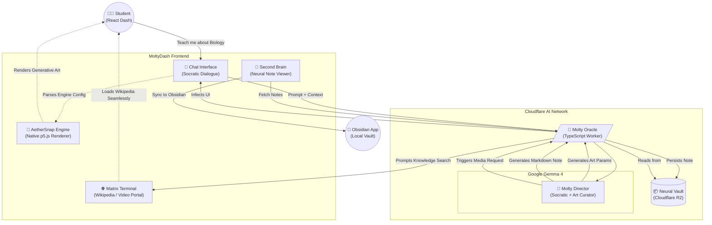

# 🎓 Edu-Molty: Google Gemma 4 Hackathon

> *Reimagining the learning journey through an adaptive, multi-tool agent powered by Google Gemma 4, featuring native generative art, a Neural Second Brain, and an embedded Knowledge Matrix Terminal.*

## 🌟 The Vision (Future of Education)
Edu-Molty is a sovereign pedagogical system designed to destroy learning friction. We integrate deep reasoning directly into an immersive web dashboard, providing students with dynamic visual feedback (AetherSnap Engine), structured knowledge retention (Neural Vault for Obsidian), and immediate curriculum-aligned research (Matrix Terminal) without ever breaking their focus.

By replacing expensive rigid LMS systems with an intelligent, adaptive, and zero-cost-per-student conversational interface, we democratize elite tutoring.

## ⚙️ Modern Technology Stack
- **Core LLM:** `Google Gemma 4` native on Cloudflare AI Edge.
- **Agent Orchestrator:** TypeScript / Native Cloudflare Workers (0ms cold start).
- **Storage Layer:** Cloudflare R2 (Neural Vault for persistent knowledge).
- **Teacher/Student Dashboard:** React 19, Vite, Tailwind CSS, Framer Motion.
- **Generative Engine:** AetherSnap Core v2.0 (Agent-controlled parameters for p5.js).
- **Knowledge Bridge:** `obsidian://` native protocol sync.

---

## 🗺️ Architectural Map (Sovereign System)



---

## 🛠️ The "WOW" Features (Agentic UI)

Edu-Molty transcends text generation by acting as a **UI Director**:

1. **`AetherSnap Generative Engine v2.0`:** Instead of relying on the LLM to write brittle code, Molty operates as an "Art Director". The agent outputs lightweight JSON parameters (`seed`, `chaos`, `density`), and the native React dashboard renders stunning, stable p5.js generative art in real-time. Refined prompts ensure zero hallucinations in English, Spanish, and Portuguese.
2. **`Neural Vault (Obsidian Sync)`:** Molty automatically extracts key knowledge milestones into structured Markdown notes stored in the Cloudflare R2 Neural Vault. Students can view their "Second Brain" in the dashboard and sync it natively to their local Obsidian app using the `obsidian://` protocol with a single click.
3. **`Knowledge Matrix Terminal`:** To bypass modern iframe blocking, the dashboard features an elegant "Visual Terminal". It seamlessly embeds multilingual Wikipedia nodes directly into the dark-mode UI, while offering a portal button for external video exploration.
4. **`Pedagogical Sovereignty`:** The agent adheres strictly to global standards (Mexico's NEM, USA's STEM, Brazil's BNCC) while maintaining a proactive, socratic mentor persona across three languages.

---

## 🚀 Quick Run (Production)

### 1. Launch the Brain (Cloudflare AI Worker)
```bash
npx wrangler deploy
```

### 2. Launch the Immersive UI (React)
```bash
cd agency-frontend
npm install
npm run build
npx wrangler pages deploy dist --project-name moltys-agency
```

*Built with ❤️ for the Google Developer Hackathon.*

