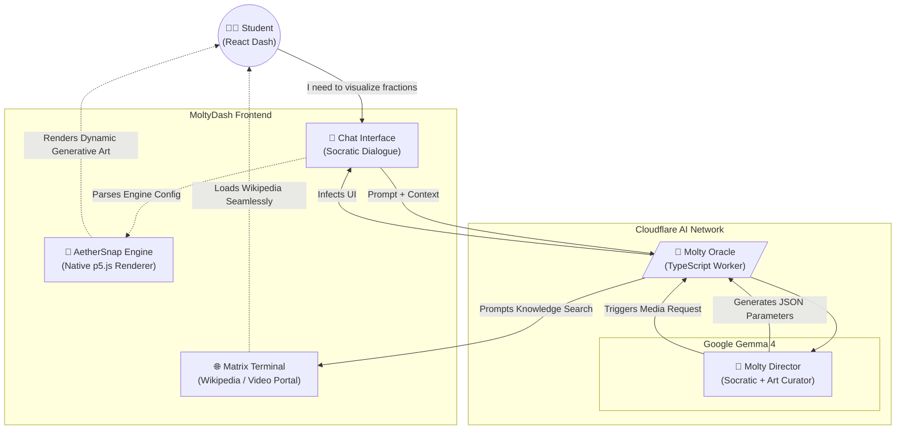

# 🎓 Edu-Molty: Google Gemma 4 Hackathon

> *Reimagining the learning journey through an adaptive, multi-tool agent powered by Google Gemma 4, featuring native generative art and an embedded Knowledge Matrix Terminal.*

## 🌟 The Vision (Future of Education)
Edu-Molty is a sovereign pedagogical system designed to destroy learning friction. We integrate deep reasoning directly into an immersive web dashboard, providing students with dynamic visual feedback (AetherSnap Engine) and immediate curriculum-aligned research (Matrix Terminal) without ever breaking their focus.

By replacing expensive rigid LMS systems with an intelligent, adaptive, and zero-cost-per-student conversational interface, we democratize elite tutoring.

## ⚙️ Modern Technology Stack
- **Core LLM:** `Google Gemma 4` native on Cloudflare AI Edge.
- **Agent Orchestrator:** TypeScript / Native Cloudflare Workers (0ms cold start).
- **Teacher/Student Dashboard:** React 19, Vite, Tailwind CSS, Framer Motion.
- **Generative Engine:** AetherSnap Core v2.0 (Embedded p5.js controlled via agent parameters).
- **Multilingual Support:** Instant i18n switching (English/STEM, Spanish/NEM, Portuguese/BNCC).

---

## 🗺️ Architectural Map (Sovereign System)



---

## 🛠️ The "WOW" Features (Agentic UI)

Edu-Molty transcends text generation by acting as a **UI Director**:

1. **`AetherSnap Generative Engine`:** Instead of relying on the LLM to write flawless code (which is prone to syntax truncation), Molty operates in "Director Mode". The agent outputs lightweight JSON parameters (`seed`, `chaos`, `density`), and the native React dashboard renders stunning, stable p5.js generative art in real-time.
2. **`Knowledge Matrix Terminal`:** To bypass modern iframe blocking (like YouTube's restrictions), the dashboard features an elegant "Visual Terminal". It seamlessly embeds multilingual Wikipedia nodes directly into the dark-mode UI, while offering a portal button for external video exploration, keeping the student fully immersed.
3. **`Vibe Engineering & Sovereignty`:** The agent is trained to adhere strictly to pedagogical guidelines (Mexico's NEM, USA's STEM, Brazil's BNCC) while maintaining a sense of humor (capable of deploying Rick Rolls or LoFi study music when appropriate).

---

## 🚀 Quick Run (Production)

### 1. Launch the Brain (Cloudflare AI Worker)
```bash
npx wrangler deploy
```

### 2. Launch the Immersive UI (React)
```bash
cd agency-frontend
npm install
npm run build
npx wrangler pages deploy dist --project-name moltys-agency
```

*Built with ❤️ for the Google Developer Hackathon.*
